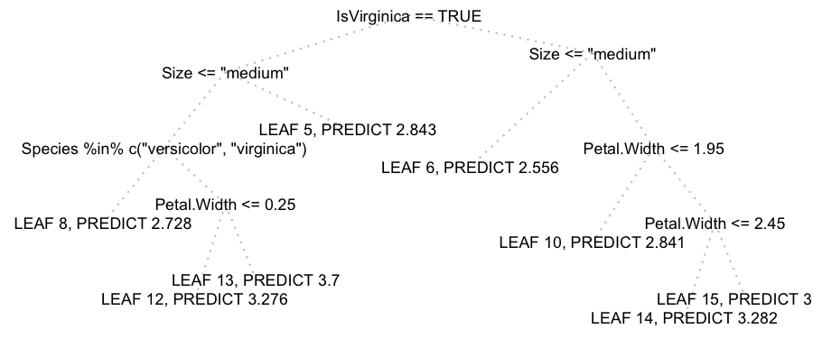

# btree
binary tree structures as data.table objects

About
------
The goals of this package are

- Easy of generation binary tree structures (including decision trees) as data.table objects
- Measure binary tree structure properties (e.g. height, path to node, etc.)
- Plot binary trees as ggplot objects

Installation
------

#### Github (development version)
```r
install.packages("devtools")
devtools::install_github("ben519/btree")
```
---

## What is a btree?

For our purposes, it's a data.table with the following structure

- Each row represents a node in the tree and is uniquely identified by NodeId
- Each row contains a ParentNodeId which points at the node's parent. (The root node has ParentId = NA)

Using the `make_btree(...)` constructor generates a LeftChildNodeId and RightChildNodeId (NA for leaf nodes) in addition to NodeId and ParentNodeId.

### Decision Tree

A btree can also be a decision tree where

- Each non-leaf node contains a decision rule determining how to split incoming data
- Rules are represented by a Split attribute, such that samples evaluating to TRUE traverse to the LeftChildNodeId and samples evaluating to FALSE go to the RightChildNodeId

Demonstration
------

#### btrees
```r
library(data.table)
library(btree)

make_btree(nodeIds=c(1,2,3,4,5,6,7), parentNodeIds=c(NA,1,1,2,2,3,3))
   NodeId ParentNodeId LeftChildNodeId RightChildNodeId NodePath Depth
1:      1           NA               2                3              0
2:      2            1               4                5        L     1
3:      3            1               6                7        R     1
4:      4            2              NA               NA       LL     2
5:      5            2              NA               NA       LR     2
6:      6            3              NA               NA       RL     2
7:      7            3              NA               NA       RR     2

make_btree(nodeIds=c(1,2,3), leftChildIds=c(2,NA,NA), rightChildIds=c(3,NA,NA))
   NodeId ParentNodeId LeftChildNodeId RightChildNodeId NodePath Depth
1:      1           NA               2                3              0
2:      2            1              NA               NA        L     1
3:      3            1              NA               NA        R     1

mytree <- make_perfect_btree(height=2)
mytree
   NodeId ParentNodeId LeftChildNodeId RightChildNodeId NodePath Depth
1:      1           NA               2                3              0
2:      2            1               4                5        L     1
3:      3            1               6                7        R     1
4:      4            2              NA               NA       LL     2
5:      5            2              NA               NA       LR     2
6:      6            3              NA               NA       RL     2
7:      7            3              NA               NA       RR     2

sub_btree(mytree, nodeId=2)
   NodeId ParentNodeId LeftChildNodeId RightChildNodeId NodePath Depth
1:      2           NA               4                5        L     1
2:      4            2              NA               NA       LL     2
3:      5            2              NA               NA       LR     2

class(mytree)  # "data.table" "data.frame"
```

#### dtrees
```r
library(data.table)
library(ggplot2)
library(randomForest)
library(btree)

# Here we train a randomForest and plot its first regression tree using all supported variable types:
# - logical
# - numeric
# - unordered factor
# - ordered factor

# build the training data
train <- iris[, c("Sepal.Width", "Petal.Width", "Species")]
train$Size <- factor(
  ifelse(iris$Sepal.Length <= 4, "short", ifelse(iris$Sepal.Length <= 6, "medium", "long")),
  levels = c("short", "medium", "long"),
  ordered = TRUE
)
train$IsVirginica <- train$Species == "virginica"

train
     Sepal.Width Petal.Width   Species   Size IsVirginica
  1:         3.5         0.2    setosa medium       FALSE
  2:         3.0         0.2    setosa medium       FALSE
  3:         3.2         0.2    setosa medium       FALSE
  4:         3.1         0.2    setosa medium       FALSE
  5:         3.6         0.2    setosa medium       FALSE
 ---                                                     
146:         3.0         2.3 virginica   long        TRUE
147:         2.5         1.9 virginica   long        TRUE
148:         3.0         2.0 virginica   long        TRUE
149:         3.4         2.3 virginica   long        TRUE
150:         3.0         1.8 virginica medium        TRUE

# train a randomForest model
set.seed(0)
rf <- randomForest(Sepal.Width ~ Petal.Width + Species + Size + IsVirginica, data = train, ntree=10)

# extract the 1st tree
dtree <- dtree_from_randomForest(rf, kthTree=1L, data=train)

dtree[, c("NodeId", "ParentNodeId", "LeftChildNodeId", "RightChildNodeId", "Split")]
    NodeId ParentNodeId LeftChildNodeId RightChildNodeId                                     Split
 1:      1           NA               2                3                       IsVirginica == TRUE
 2:      2            1               4                5                           Size <= "medium
 3:      3            1               6                7                           Size <= "medium
 4:      4            2               8                9 Species %in% c("versicolor", "virginica")
 5:      5            2              NA               NA                                        NA
 6:      6            3              NA               NA                                        NA
 7:      7            3              10               11                       Petal.Width <= 1.95
 8:      8            4              NA               NA                                        NA
 9:      9            4              12               13                       Petal.Width <= 0.25
10:     10            7              NA               NA                                        NA
11:     11            7              14               15                       Petal.Width <= 2.45
12:     12            9              NA               NA                                        NA
13:     13            9              NA               NA                                        NA
14:     14           11              NA               NA                                        NA
15:     15           11              NA               NA                                        NA


# make a pretty label column and plot it
dtree[, Label := ifelse(is.na(LeftChildNodeId), paste("LEAF", NodeId), Split)]
plot_btree(dtree, labelCol = "Label")
```


## TODO
- Possible speed improvement for dtree_node_conditions by retaining path to each node as NodeIds or indices instead of LRLR to prevent looping over each depth
- Create btreeforest and dtreeforest classes?

## Contact
If you'd like to contact me regarding bugs, questions, or general consulting, feel free to drop me a line - bgorman519@gmail.com
